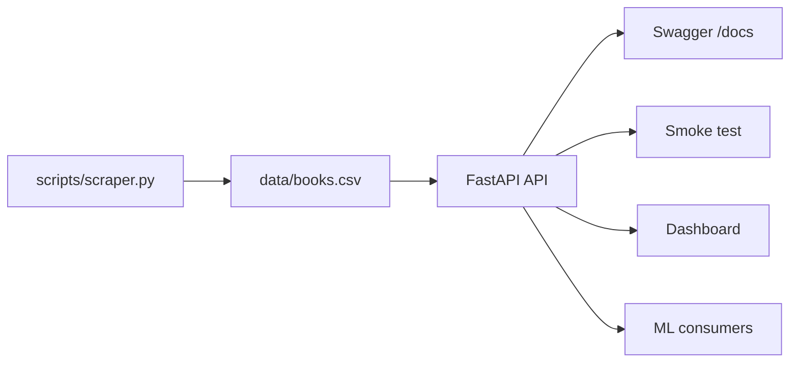

# Tech Challenge - Books API (Fase 1)

API REST para consulta e análise de livros extraídos via Web Scraping, desenvolvida como parte da Pós-Tech em Machine Learning Engineering da FIAP.

## 1. Visão Geral

Este projeto implementa um pipeline completo de dados:
1.  **Coleta**: Script de scraping extrai dados de livros do site *Books to Scrape*.
2.  **Processamento**: Dados estruturados e limpos são persistidos em CSV.
3.  **API**: Interface REST (FastAPI) serve os dados, estatísticas e recursos para ML.
4.  **Consumo**: Dados prontos para dashboards e treinamento de modelos.

## 2. Arquitetura



## 3. Estrutura do Repositório

```text
/
├── api/                # Código fonte da API (FastAPI)
│   ├── main.py         # Entrypoint e definição de rotas
│   └── models.py       # Modelos Pydantic (contratos)
├── dashboard/          # Aplicação Streamlit (Visualização)
├── data/               # Armazenamento de dados (books.csv)
├── scripts/            # Scripts auxiliares (scraper, testes)
├── requirements.txt    # Dependências do projeto
└── README.md           # Documentação
```

## 4. Como Rodar Localmente

### Instalação

Pré-requisitos: Python 3.9+.

1.  Clone o repositório e acesse a pasta.
2.  (Opcional) Crie e ative um ambiente virtual:
    ```bash
    python -m venv venv
    # Windows: venv\Scripts\activate
    # Linux/Mac: source venv/bin/activate
    ```
3.  Instale as dependências:
    ```bash
    pip install -r requirements.txt
    ```

### Execução

Inicie o servidor de desenvolvimento:

```bash
uvicorn api.main:app --reload
```

A API estará disponível em `http://127.0.0.1:8000`.

## 5. Deploy (Render)

A API está publicada e acessível publicamente:

-   **Base URL**: `https://tech-challenge-books-api-t9a4.onrender.com`
-   **Documentação Interativa (Swagger)**: [https://tech-challenge-books-api-t9a4.onrender.com/docs](https://tech-challenge-books-api-t9a4.onrender.com/docs)

## 6. Endpoints

### Obrigatórios
| Método | Rota | Descrição |
| :--- | :--- | :--- |
| `GET` | `/api/v1/books` | Lista livros (paginado). |
| `GET` | `/api/v1/books/{book_id}` | Detalhes de um livro (pelo ID numérico). |
| `GET` | `/api/v1/books/search?title=&category=` | Busca por `title` e/ou `category`. |
| `GET` | `/api/v1/categories` | Lista de categorias. |
| `GET` | `/api/v1/health` | Status da API. |

### Bônus e Recursos Extras
| Método | Rota | Descrição |
| :--- | :--- | :--- |
| `POST` | `/api/v1/auth/login` | Autenticação (JWT). |
| `POST` | `/api/v1/auth/refresh` | Renovação de token. |
| `POST` | `/api/v1/scraping/trigger` | **(Protegido)** Dispara atualização dos dados. |
| `GET` | `/api/v1/stats/overview` | Métricas gerais. |
| `GET` | `/api/v1/stats/categories` | Métricas por categoria. |
| `GET` | `/api/v1/ml/features` | Dados formatados para ML. |
| `GET` | `/api/v1/ml/training-data` | Download do dataset (CSV). |
| `POST` | `/api/v1/ml/predictions` | Simulação de inferência. |

### Exemplos de Chamadas (CURL)

**1. Health Check:**
```bash
curl -s "https://tech-challenge-books-api-t9a4.onrender.com/api/v1/health"
```

**2. Listar Livros:**
```bash
curl -s "https://tech-challenge-books-api-t9a4.onrender.com/api/v1/books?page=1&size=5"
```

**3. Buscar Livros:**
```bash
curl -s "https://tech-challenge-books-api-t9a4.onrender.com/api/v1/books/search?title=travel"
```

**4. Categorias:**
```bash
curl -s "https://tech-challenge-books-api-t9a4.onrender.com/api/v1/categories"
```

**5. Login:**
```bash
curl -s -X POST "https://tech-challenge-books-api-t9a4.onrender.com/api/v1/auth/login" \
  -H "Content-Type: application/json" \
  -d "{\"username\":\"admin\",\"password\":\"admin\"}"
```

**6. Rota Protegida (Exemplo de uso do Token):**
```bash
# Substitua <TOKEN> pelo valor recebido no login
curl -s -X POST "https://tech-challenge-books-api-t9a4.onrender.com/api/v1/scraping/trigger" \
  -H "Authorization: Bearer <TOKEN>"
```

## 7. Autenticação (JWT)

O sistema utiliza JSON Web Tokens para proteção de rotas administrativas.
-   **Credenciais Padrão**: `admin` / `admin`
-   **Fluxo**: Login -> Recebe Token -> Envia Token no Header `Authorization`.

## 8. Scripts

-   **Scraper**: `python scripts/scraper.py`
    -   Extrai dados novos e atualiza `data/books.csv`.
-   **Smoke Test**: `python scripts/smoke_test.py`
    -   Valida os principais endpoints da API localmente.

## 9. Vídeo

Link: https://www.youtube.com/watch?v=rzJvtBiQo0A

## 10. Licença

Consulte o arquivo [LICENSE](./LICENSE) para mais detalhes.
